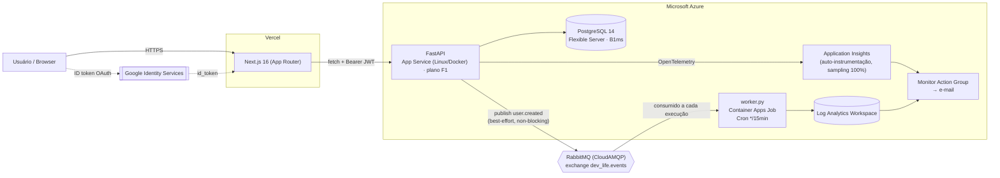
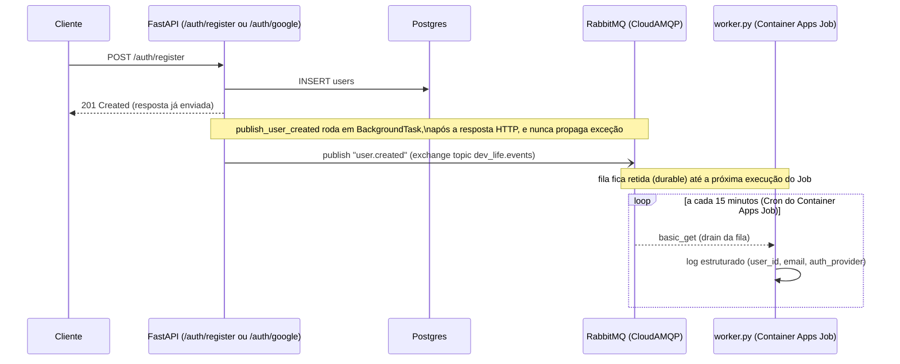

# Dev Life API

API de produtividade pessoal (tarefas, hábitos, autenticação) em **FastAPI + Postgres**, com pipeline de CI/CD, infraestrutura como código no Azure, mensageria assíncrona e observabilidade — construída como material de portfólio para uma posição de **Cloud/DevOps Jr**.

O foco deste README não é "como usar a API", é **como o sistema é construído, testado, implantado e observado**. Frontend: [`dev-life-web`](https://github.com/Gabriel24701/dev-life-web).

[](https://github.com/Gabriel24701/dev-life-api/actions/workflows/ci.yml)

---

## 1. Arquitetura



| Camada | Tecnologia | Onde roda |
|---|---|---|
| Frontend | Next.js 16 (App Router) | Vercel |
| API | FastAPI + SQLAlchemy 2.0 (Python 3.11) | Azure App Service (container Linux) |
| Banco | PostgreSQL 14 | Azure Database for PostgreSQL – Flexible Server |
| Fila | RabbitMQ | CloudAMQP (gerenciado, fora do Azure) |
| Worker assíncrono | `worker.py` | Azure Container Apps Job (agendado via Cron) |
| Observabilidade | Application Insights + Log Analytics | Azure Monitor |
| IaC | Terraform (`azurerm` ~> 3.0) | — |
| CI/CD | GitHub Actions | GitHub |

**Regiões usadas de fato** (extraído do `terraform.tfstate`, 13 recursos): Resource Group e Postgres em `canadacentral`; App Service, Container Apps, Log Analytics e Application Insights em `centralus`; o Action Group de alerta em `eastus`. Não é um design multi-região deliberado — é o estado real da conta.

---

## 2. CI/CD

Dois repositórios, dois pipelines independentes (GitHub Actions).

### `dev-life-api` — `.github/workflows/ci.yml`

Disparado em `push` para `dev`/`main`/`security` e em `pull_request` para `dev`/`main`. Três jobs em sequência:

| Job | O que faz |
|---|---|
| **`quality_and_security`** | `pytest --cov=. --cov-report=xml` (58 testes) → upload do relatório de cobertura pro SonarCloud (`sonarqube-scan-action@v5`). |
| **`migrations_check`** | Sobe um **Postgres 14 descartável** como service container, recria o schema pré-Alembic via `Base.metadata.create_all`, faz `alembic stamp 8b9b5db169b4` (a baseline) e então `alembic upgrade head` — validando qualquer migration nova contra um banco real antes do merge. Nunca toca produção. |
| **`integration_and_delivery`** | Depende dos dois jobs acima. Build da imagem Docker, push para `bielllb/dev-life-api:latest` no Docker Hub, e `curl -X POST` no webhook de deploy do Azure App Service (redeploy automático assim que a nova imagem chega ao registry). |

### `dev-life-api` — `.github/workflows/migrate-production.yml`

Workflow **manual** (`workflow_dispatch`), nunca atrelado a push/merge. Só roda se o input `confirm` for exatamente `"sim"`. Executa `alembic upgrade head` contra `secrets.PRODUCTION_DATABASE_URL`. Aplicar schema em produção é sempre um ato deliberado de alguém, nunca automático.

### `dev-life-web` — `.github/workflows/ci.yml`

Disparado só em `pull_request` para `dev`/`main` (não em push direto). Um job: `type-check` (`tsc --noEmit`) → `vitest run --coverage` (43 testes) → `eslint` → SonarCloud. Não há step de deploy aqui — o deploy do frontend acontece pela integração nativa da Vercel com o GitHub (build a cada push/merge), fora do Actions; este pipeline garante qualidade **antes** do merge.

---

## 3. Infraestrutura como Código (Terraform)

Todo o Azure é gerenciado por Terraform em `infra/` (`main.tf`, `monitoring.tf`, `variables.tf`, `outputs.tf`, provider `azurerm ~> 3.0`). **13 recursos** no state, um a um espelhando o que está declarado — sem recurso órfão nem drift entre o que o Terraform acha que existe e o que está de fato provisionado:

| Recurso | Nome | Detalhe |
|---|---|---|
| `azurerm_resource_group` | `rg-dev-life-backend` | agrupa tudo |
| `azurerm_postgresql_flexible_server` | `psql-devlife-bielllb-01` | v14, `B_Standard_B1ms`, 32 GB, zone 1 |
| `azurerm_postgresql_flexible_server_database` | `devlife_db` | — |
| `azurerm_postgresql_flexible_server_firewall_rule` | `AllowAzureServices` | `0.0.0.0`–`0.0.0.0` (regra especial do Azure) |
| `azurerm_service_plan` | `plan-dev-life-central` | Linux, SKU `F1` (free tier) |
| `azurerm_linux_web_app` | `app-devlife-api-bielllb-01` | imagem Docker do Docker Hub, `WEBSITES_PORT=8000` |
| `azurerm_log_analytics_workspace` | `log-devlife-worker` | retenção de 30 dias |
| `azurerm_container_app_environment` | `cae-devlife-worker` | ambiente do Job |
| `azurerm_container_app_job` | `job-devlife-worker` | ver seção 5 |
| `azurerm_application_insights` | `appi-devlife-api` | workspace-based, retenção de 90 dias |
| `azurerm_monitor_action_group` | `personal-dev-life` | 1 destinatário por e-mail |
| `azurerm_monitor_scheduled_query_rules_alert_v2` | `alert-worker-rabbitmq-conexao` | KQL sobre logs do Job |
| `azurerm_monitor_metric_alert` | `alert-api-http5xx` | métrica nativa do App Service |

Todos os segredos (`db_password`, `rabbitmq_url`, `google_client_id`) são `variable` `sensitive = true`, passados via `terraform.tfvars` local — que, junto com `*.tfstate` e `.terraform/`, está no `.gitignore` e nunca foi commitado.

**Limitações honestas do state atual:** não há backend remoto configurado (`versions.tf` não declara `backend {}`) — o `.tfstate` é local. Funciona para um projeto solo, mas não tem locking nem é compartilhável em time; seria o próximo passo natural (Azure Storage Account como backend). Também vale notar que `SECRET_KEY` da API **não** está entre as `app_settings` do Terraform — ao contrário de `DATABASE_URL`, `GOOGLE_CLIENT_ID`, `RABBITMQ_URL` e a connection string do App Insights, que estão todas ali.

---

## 4. Observabilidade

- **Health check real** (`GET /health`): executa `SELECT 1` contra o Postgres e responde `200 {"status": "healthy"}` ou `503 {"status": "unhealthy"}` — não é um "ping" estático, reflete a saúde da dependência crítica.
- **Application Insights com auto-instrumentação**: `configure_azure_monitor(sampling_ratio=1.0)` (`azure-monitor-opentelemetry`) é ativado em `main.py` **somente se** `APPLICATIONINSIGHTS_CONNECTION_STRING` estiver definida — dev local não precisa dela. `sampling_ratio=1.0` = sem amostragem (nenhum request é descartado), decisão coerente com o volume baixo do projeto.
- **Alertas por e-mail** (Action Group, 1 destinatário), dois independentes:
  - **5xx na API**: métrica nativa `Http5xx` do App Service, `threshold > 0` (qualquer 5xx dispara), janela de 5min avaliada a cada 1min.
  - **Worker sem conseguir falar com o RabbitMQ**: *scheduled query* em KQL sobre `ContainerAppConsoleLogs_CL`, avaliada a cada 15min numa janela de 30min (deliberadamente maior que a frequência do Cron de 15min, pra não avaliar janelas em que o Job simplesmente não rodou):
    ```kql
    ContainerAppConsoleLogs_CL
    | where ContainerJobName_s == "job-devlife-worker"
    | where Log_s has "Nao foi possivel conectar/configurar o RabbitMQ"
    ```
- **Logs estruturados e consultáveis**: tanto a API (via App Insights) quanto o worker (via Log Analytics, `ContainerAppConsoleLogs_CL`) escrevem logs que viram fonte de consulta KQL — a query do alerta acima é literalmente a mesma sintaxe usada pra investigar incidentes manualmente no portal.

---

## 5. Mensageria assíncrona (RabbitMQ)

Fluxo do evento `user_created`:



- **Publisher** (`messaging/publisher.py`): declara exchange `dev_life.events` (topic, durable), publica em `user.created` com `delivery_mode=2` (persistente). Roda dentro de `BackgroundTasks` do FastAPI — a resposta HTTP do registro **já foi enviada** antes do publish acontecer.
- **Resiliência**: `publish_user_created` nunca deixa uma exceção escapar. Sem `RABBITMQ_URL` configurada, só loga em `INFO` e retorna (dev local não precisa de RabbitMQ). Se a conexão falhar (fila fora do ar, timeout, credencial inválida), loga em `ERROR` com stacktrace e segue — **o registro do usuário nunca falha por causa da fila**. Timeouts curtos e deliberados (`connection_attempts=1`, `socket_timeout=5s`, `blocked_connection_timeout=5s`) evitam que uma fila lenta trave o processo.
- **Consumidor** (`worker.py`): roda como **Container Apps Job agendado** (`cron_expression = "*/15 * * * *"`, ou seja, **a cada 15 minutos**), não como serviço always-on. Cada execução drena a fila `dev_life.user_created` até esvaziar ou até um limite de segurança: no máximo **500 mensagens** ou **60 segundos** por execução (`WORKER_MAX_MESSAGES` / `WORKER_MAX_SECONDS`, configuráveis por env var) — o que sobrar fica para a próxima execução do Cron, evitando que um acúmulo anormal prenda o Job indefinidamente. Uma mensagem individual malformada é descartada (`nack` sem requeue) sem interromper o drain das demais; já uma falha de conexão com o broker propaga e derruba a execução do Job (tratado pelo alerta da seção 4).

---

## 6. Migrations (Alembic)

- Uma única migration hoje: `alembic/versions/8b9b5db169b4_baseline_schema_atual_de_producao.py` — a **baseline**, que reconhece o schema que já existia em produção (criado historicamente por `Base.metadata.create_all`, sem Alembic) em vez de recriá-lo.
- `migrations/0001_add_google_auth.sql` é um **registro histórico** de uma alteração aplicada manualmente antes do Alembic existir (colunas `auth_provider`/`google_sub`) — não é mais o fluxo atual, só documentação do passado.
- O procedimento de baseline (feito **uma única vez**) está documentado passo a passo em [`docs/alembic-baseline-runbook.md`](docs/alembic-baseline-runbook.md): dump do schema de produção → restaurar num Postgres **descartável** → `alembic revision --autogenerate` → conferir que o diff vem **vazio** (confirma que os models batem com produção) → só então `alembic stamp head` em produção (nunca `upgrade`, porque a baseline é metadado puro, sem DDL).
- Fluxo normal daqui pra frente: alterar model → gerar migration → testar contra Postgres local → o CI valida automaticamente (seção 2, job `migrations_check`) → aplicar em produção é sempre manual via `migrate-production.yml`, nunca automático em push/merge.
- Alguns campos do model (ex.: `UniqueConstraint("google_sub", name="users_google_sub_key")`, `DateTime` sem timezone em `Task`/`Habit`) são deliberadamente escritos para bater exatamente com o schema real de produção — comentários no código (`models/models.py`) documentam por quê, já que parte do schema nasceu de `ALTER TABLE` manuais antes do Alembic.

---

## 7. Testes

**101 testes no total** — 58 no backend, 43 no frontend.

### Backend (pytest) — 58 testes, 11 arquivos

| Arquivo | Testes | Foco |
|---|---|---|
| `test_auth.py` | 12 | registro, login local, hashing, JWT |
| `test_google_auth.py` | 7 | login/registro via Google (`id_token.verify_oauth2_token` mockado) |
| `test_tasks_crud.py` | 8 | CRUD de tarefas |
| `test_tasks_ownership.py` | 5 | isolamento entre usuários |
| `test_habits_crud.py` | 4 | CRUD de hábitos |
| `test_habits_ownership.py` | 5 | isolamento entre usuários |
| `test_habits_streak.py` | 8 | cálculo de streak (dia civil, `AlreadyCompletedTodayError`) |
| `test_worker.py` | 4 | `drain_queue`/`handle_user_created_event` com canal fake |
| `test_messaging_publisher.py` | 2 | resiliência do publish (sem URL / falha de conexão) |
| `test_health.py` | 2 | `/health` |
| `test_main.py` | 1 | app sobe |

**Filosofia**: banco SQLite **in-memory** por teste (schema criado e destruído a cada teste, `StaticPool`); nenhuma dependência externa real — RabbitMQ é desligado por uma fixture `autouse`, a verificação do Google é mockada via `monkeypatch`, e o worker é testado contra um **canal `pika` fake** (`_FakeChannel`) em vez de um broker real. **10 dos 58 testes são especificamente de ownership** (5 tasks + 5 habits): confirmam que o usuário B não vê, não edita, não completa e não apaga dados do usuário A — e que a resposta é sempre `404` (nunca `403`), pra não revelar a um atacante que o recurso existe.

### Frontend (Vitest + Testing Library) — 43 testes, 9 arquivos

`TasksContext.test.tsx` e `HabitsContext.test.tsx` concentram 20 dos 43 testes; o restante cobre páginas (`login`, `settings`, filtros de tarefas) e modais de formulário. **Nenhum teste faz chamada de rede real**: `src/services/api.ts` é mockado via `vi.mock`, o que testa o comportamento dos Contexts/componentes de forma isolada e determinística.

### Cobertura

Ambos os pipelines geram relatório de cobertura (`coverage.xml` via `pytest-cov` no backend, `lcov.info` via `@vitest/coverage-v8` no frontend) e enviam para o **SonarCloud** (`sonar-project.properties` em cada repo), que também roda as análises estáticas de qualidade/segurança do código.

---

## 8. Segurança

- **Senhas**: hash com `bcrypt` (salt por senha), nunca texto plano em nenhum lugar do código ou do banco.
- **JWT**: `HS256`, expiração de 7 dias (`ACCESS_TOKEN_EXPIRE_MINUTES = 60*24*7`), assinado com `SECRET_KEY` (variável de ambiente — tem um valor padrão de desenvolvimento no código, deve ser sobrescrita em produção; ver seção 3 sobre o Terraform não declarar essa variável).
- **OAuth Google**: `POST /auth/google` valida o `id_token` recebido do frontend contra `GOOGLE_CLIENT_ID` (biblioteca oficial `google-auth`, checa `aud` e `email_verified`). Contas são vinculadas por `google_sub` (estável mesmo se o e-mail mudar); se já existir uma conta local com o mesmo e-mail, retorna `409 Conflict` em vez de fundir silenciosamente as contas.
- **Isolamento de dados entre usuários (ownership)**: toda query de `Task`/`Habit` filtra por `owner_id == current_user.id`; tentativa de acessar recurso alheio retorna `404` (não `403`), testado explicitamente em 10 dos 58 testes de backend (seção 7).
- **CORS**: `allow_origins` restrito a `localhost:3000` (dev) e `https://dev-life-web.vercel.app` (produção) — não é `*`.

---

## Rodando localmente

```bash
python -m venv venv
venv\Scripts\activate          # Windows
pip install -r requirements.txt
uvicorn main:app --reload      # http://localhost:8000/docs
```

Sem `DATABASE_URL`, cai automaticamente em SQLite local (`devlife_local.db`) e cria o schema via `create_all` — só em Postgres (produção) o schema é gerenciado pelo Alembic.

| Variável | Obrigatória | Descrição |
|---|---|---|
| `DATABASE_URL` | Não | Postgres em produção; sem ela, SQLite local. |
| `SECRET_KEY` | Recomendada | Assina os JWT; tem fallback de dev, sobrescreva em produção. |
| `GOOGLE_CLIENT_ID` | Sim, para login Google | Audiência esperada do `id_token`. |
| `RABBITMQ_URL` | Não | Sem ela, `publish_user_created` só loga e não tenta conectar. |
| `APPLICATIONINSIGHTS_CONNECTION_STRING` | Não | Sem ela, telemetria fica desligada (dev local não precisa). |

```bash
docker compose up   # sobe API + frontend juntos (ver docker-compose.yml)
```
